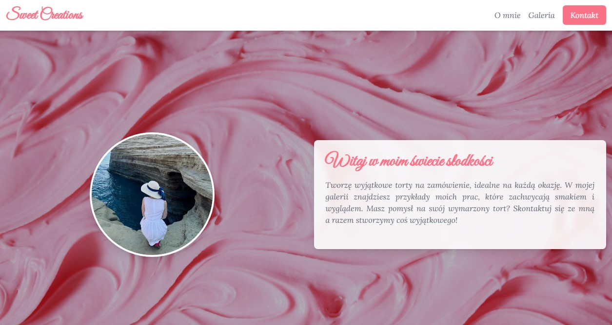
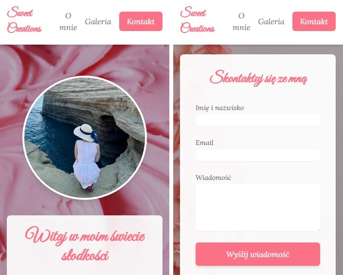

# Sweet Creations (React) - Projekt Zawieszony

Ten projekt został **zawieszony** i nie będzie dalej rozwijany w tej technologii.  
Obecnie jest kontynuowany w **Next.js** w innym repozytorium.

## Nowe Repozytorium
Projekt w **Next.js** jest dostępny tutaj:  
➡️ [Sweet Creations - Next.js](https://github.com/rafalwizen/sweet-creations-next-js)

## Technologia
- React

## Screeny ze strony

## Kontakt
Jeśli chcesz się skontaktować, napisz na: [rafal.wizen@gmail.com](mailto:rafal.wizen@gmail.com)

## Licencja
Projekt jest na licencji MIT.